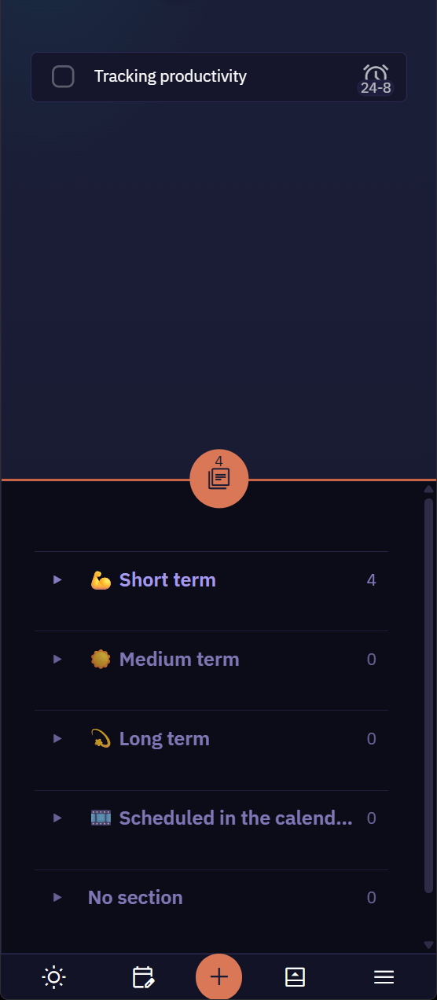
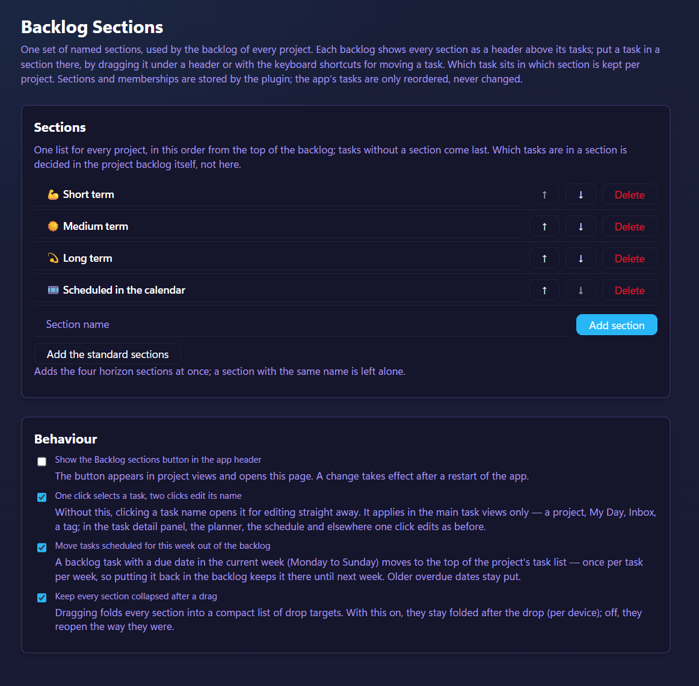

# Backlog Sections — a Super Productivity plugin

Backlog Sections adds named sections to the backlog of each project in [Super Productivity](https://github.com/super-productivity/super-productivity). You define the sections once and every project's backlog uses the same set. Drag a task under another header and it moves to that section. Sections and memberships are stored by the plugin; the app's tasks are never changed, only the order of the backlog list (`backlogTaskIds`).

## Why
A project backlog is one flat list. As it grows, tasks pile up without much structure, making it harder to see what deserves attention, what can wait, and what belongs together.

Dates do not solve this for every task. Many backlog items have no meaningful deadline or scheduled date, and adding one just for organization creates false precision. Sections give you a broader way to structure the backlog without forcing every task onto a calendar.

Sections can represent time horizon, priority, status, context, area of work, or anything else that fits your workflow. The default sections use time horizons as an example, not as a requirement.

Because that judgement can change, moving tasks between sections is deliberately lightweight: just drag and drop. Tasks that have not been categorized remain visible under No section.

## Install

Requires Super Productivity 18.19.0 or newer, with the backlog enabled for the project.
Download the plugin from the latest [release](https://github.com/roosmsg/sp-backlog-sections/releases) — upload it under **Settings → Plugins** and enable it. Open the plugin's settings page to add the standard sections or type your own. The section list is shared by every project; which task sits in which section is not.

## Using it

- **Drag** — a section owns the band from its header down to the next one, so a drop anywhere in that band files the task there. This is the only way into a section that is still empty in this project.
- **Keyboard** — the app's own move up/down reorder inside a section and step to the neighbouring one from its first or last row; *move to top* clears a task's section. The plugin adds *Move task to the section above* / *below*, which work from any row (bind under Settings → Keyboard shortcuts).
- **Collapse** — click a header; the state is remembered per device.
- **Behaviour options** — on the settings page: one click selects a task and a double click opens its name for editing (main task views only); tasks due this week move out of the backlog; sections stay collapsed after a drag; the ⊞ button can be hidden.

## License

[MIT](LICENSE).
